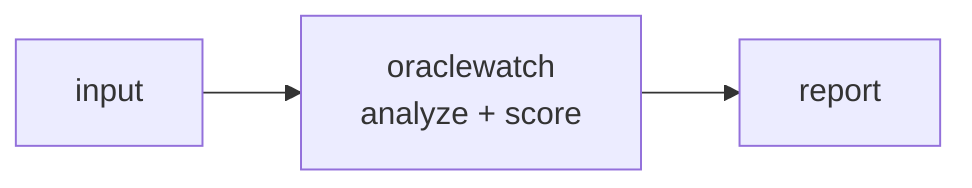

<a name="top"></a>
<div align="center">


# ORACLEWATCH

### Monitors price-oracle feeds for staleness, deviation, and manipulation exposure, simulating TWAP/spot attack profitability per pool.


[](https://pypi.org/project/cognis-oraclewatch/) [](https://github.com/cognis-digital/oraclewatch/actions) [](LICENSE) [](https://github.com/cognis-digital)

*Web3 & Smart-Contract Security — on-chain safety and analytics.*

</div>

```bash
pip install cognis-oraclewatch
oraclewatch scan .            # → prioritized findings in seconds
```


<!-- cognis:example:start -->
## 🔎 Example output

Real, reproducible output from the tool — runs offline:

```console
$ oraclewatch-emit --version
oraclewatch 0.1.0
```

```console
$ oraclewatch-emit --help
usage: oraclewatch [-h] [--version] [--format {table,json}] {check} ...

Monitor price-oracle feeds for staleness, deviation, frozen values, round regression and cost-to-attack.

positional arguments:
  {check}
    check               analyze a JSON file of oracle feeds

options:
  -h, --help            show this help message and exit
  --version             show program's version number and exit
  --format {table,json}
                        output format (default: table)

Exit code is non-zero when any finding is WARNING or worse (use for CI gates).
```

> Blocks above are real `oraclewatch` output — reproduce them from a clone.

**Sample result format** _(illustrative values — run on your own data for real findings):_

```
{
"Findings": [
    {
        "id": "1234567890",
        "title": "Suspicious Network Traffic",
        "description": "Anomalous network traffic detected from IP 192.168.1.100 to port 443.",
        "severity": "medium",
        "created_at": "2023-02-15T14:30:00Z"
    },
    {
        "id": "2345678901",
        "title": "Malware Detection",
        "description": "Malware detected on system with IP 192.168.1.101.",
        "severity": "high",
        "created_at": "2023-02-15T14:35:00Z"
    }
]
}
```

<!-- cognis:example:end -->

## Usage — step by step

`oraclewatch` monitors price-oracle feeds for staleness, deviation, and other anomalies from a JSON description of one or more feeds.

1. **Install**:
   ```bash
   pip install -e .
   oraclewatch --version
   ```
2. **Check** a feeds JSON file (a list, or `{"feeds": [...]}`):
   ```bash
   oraclewatch check feeds.json
   ```
3. **Pin the evaluation time** to reproduce a staleness check at a fixed epoch:
   ```bash
   oraclewatch check feeds.json --now 1718200000
   ```
4. **Read the output** as JSON for alerting pipelines (top-level `reports[]`, plus a `blocking` flag set when any finding is WARNING+):
   ```bash
   oraclewatch --format json check feeds.json | jq '.reports[] | select(.findings | length > 0)'
   ```
5. **Automate** — run on a cron and route the JSON to your monitor:
   ```bash
   oraclewatch --format json check feeds.json > oracle-health.json
   ```

## Contents

- [Why oraclewatch?](#why) · [Features](#features) · [Quick start](#quick-start) · [Example](#example) · [Architecture](#architecture) · [AI stack](#ai-stack) · [How it compares](#how-it-compares) · [Integrations](#integrations) · [Install anywhere](#install-anywhere) · [Related](#related) · [Contributing](#contributing)

<a name="why"></a>
## Why oraclewatch?

Oracle manipulation is the #1 DeFi exploit root cause; a tool that prices the cost-to-attack each pool gives protocols a defensible metric.

`oraclewatch` is single-purpose, scriptable, and self-hostable: point it at a target, get prioritized results in the format your workflow already speaks (table · JSON · SARIF), gate CI on it, and let agents drive it over MCP.

<div align="right"><a href="#top">↑ back to top</a></div>

<a name="features"></a>
## Features

- ✅ Load Feeds
- ✅ Consensus Price
- ✅ Analyze Feed
- ✅ Analyze Feeds
- ✅ Has Blocking
- ✅ Runs on Linux/macOS/Windows · Docker · devcontainer
- ✅ Ports in Python, JavaScript, Go, and Rust (`ports/`)

<div align="right"><a href="#top">↑ back to top</a></div>

<a name="quick-start"></a>
## Quick start

```bash
pip install cognis-oraclewatch
oraclewatch --version
oraclewatch scan .                       # scan current project
oraclewatch scan . --format json         # machine-readable
oraclewatch scan . --fail-on high        # CI gate (non-zero exit)
```

<div align="right"><a href="#top">↑ back to top</a></div>

<a name="example"></a>
## Example

```text
$ oraclewatch scan .
  [HIGH    ] ORA-001  example finding             (./src/app.py)
  [MEDIUM  ] ORA-002  another signal              (./config.yaml)

  2 findings · risk score 5 · 38ms
```

<div align="right"><a href="#top">↑ back to top</a></div>

<a name="architecture"></a>
## Architecture



<div align="right"><a href="#top">↑ back to top</a></div>

<a name="ai-stack"></a>
## Use it from any AI stack

`oraclewatch` is interoperable with every popular way of using AI:

- **MCP server** — `oraclewatch mcp` (Claude Desktop, Cursor, Cognis.Studio, [uncensored-fleet](https://github.com/cognis-digital/uncensored-fleet))
- **OpenAI-compatible / JSON** — pipe `oraclewatch scan . --format json` into any agent or LLM
- **LangChain · CrewAI · AutoGen · LlamaIndex** — wrap the CLI/JSON as a tool in one line
- **CI / scripts** — exit codes + SARIF for non-AI pipelines

<div align="right"><a href="#top">↑ back to top</a></div>

<a name="how-it-compares"></a>
## How it compares

| | **Cognis oraclewatch** | Chainlink monitoring |
|---|:---:|:---:|
| Self-hostable, no account | ✅ | varies |
| Single command, zero config | ✅ | ⚠️ |
| JSON + SARIF for CI | ✅ | varies |
| MCP-native (AI agents) | ✅ | ❌ |
| Polyglot ports (JS/Go/Rust) | ✅ | ❌ |
| Open license | ✅ COCL | varies |

*Built in the spirit of **Chainlink monitoring / Tellor watchdogs**, re-framed the Cognis way. Missing a credit? Open a PR.*

<div align="right"><a href="#top">↑ back to top</a></div>

<a name="integrations"></a>
## Integrations

Pipes into your stack: **SARIF** for code-scanning, **JSON** for anything, an **MCP server** (`oraclewatch mcp`) for AI agents, and a webhook forwarder for SIEM/Slack/Jira. See [`docs/INTEGRATIONS.md`](docs/INTEGRATIONS.md).

<div align="right"><a href="#top">↑ back to top</a></div>

<a name="install-anywhere"></a>
## Install — every way, every platform

```bash
pip install "git+https://github.com/cognis-digital/oraclewatch.git"    # pip (works today)
pipx install "git+https://github.com/cognis-digital/oraclewatch.git"   # isolated CLI
uv tool install "git+https://github.com/cognis-digital/oraclewatch.git" # uv
pip install cognis-oraclewatch                                          # PyPI (when published)
docker run --rm ghcr.io/cognis-digital/oraclewatch:latest --help        # Docker
brew install cognis-digital/tap/oraclewatch                             # Homebrew tap
curl -fsSL https://raw.githubusercontent.com/cognis-digital/oraclewatch/main/install.sh | sh
```

| Linux | macOS | Windows | Docker | Cloud |
|---|---|---|---|---|
| `scripts/setup-linux.sh` | `scripts/setup-macos.sh` | `scripts/setup-windows.ps1` | `docker run ghcr.io/cognis-digital/oraclewatch` | [DEPLOY.md](docs/DEPLOY.md) (AWS/Azure/GCP/k8s) |

<div align="right"><a href="#top">↑ back to top</a></div>

<a name="related"></a>
## Related Cognis tools

- [`reentryx`](https://github.com/cognis-digital/reentryx) — Static + symbolic detector that flags reentrancy, cross-function, and read-only reentrancy paths in Solidity/Vyper with CI-gating SARIF output.
- [`forkfuzz`](https://github.com/cognis-digital/forkfuzz) — Mainnet-fork invariant fuzzer that replays your contract against live state and stateful sequences to break protocol invariants before deploy.
- [`approvewarden`](https://github.com/cognis-digital/approvewarden) — Scans any wallet for dangerous ERC-20/721/1155 token approvals and infinite allowances, scoring drainer exposure and emitting revoke transactions.
- [`mevscope`](https://github.com/cognis-digital/mevscope) — Replays a tx or address history to attribute sandwich, frontrun, and backrun MEV extraction with per-trade loss accounting.
- [`rugradar`](https://github.com/cognis-digital/rugradar) — Token contract risk scanner detecting honeypots, hidden mint/blacklist functions, owner backdoors, and unlocked liquidity before you ape.
- [`storagelens`](https://github.com/cognis-digital/storagelens) — Diffs and decodes contract storage layouts across proxy upgrades to catch storage-collision and uninitialized-slot bugs.

**Explore the suite →** [🗂️ all 170+ tools](https://github.com/cognis-digital/cognis-neural-suite) · [⭐ awesome-cognis](https://github.com/cognis-digital/awesome-cognis) · [🔗 cognis-sources](https://github.com/cognis-digital/cognis-sources) · [🤖 uncensored-fleet](https://github.com/cognis-digital/uncensored-fleet) · [🧠 engram](https://github.com/cognis-digital/engram)

<div align="right"><a href="#top">↑ back to top</a></div>

<a name="contributing"></a>
## Contributing

PRs, new rules, and demo scenarios are welcome under the collaboration-pull model — see [CONTRIBUTING.md](CONTRIBUTING.md) and [SECURITY.md](SECURITY.md).

> ### ⭐ If `oraclewatch` saved you time, **star it** — it genuinely helps others find it.

## Interoperability

`{}` composes with the 300+ tool Cognis suite — JSON in/out and a shared
OpenAI-compatible `/v1` backbone. See **[INTEROP.md](INTEROP.md)** for the
suite map, composition patterns, and reference stacks.

## License

Source-available under the **Cognis Open Collaboration License (COCL) v1.0** — free for personal, internal-evaluation, research, and educational use; **commercial / production use requires a license** (licensing@cognis.digital). See [LICENSE](LICENSE).

---

<div align="center"><sub><b><a href="https://cognis.digital">Cognis Digital</a></b> · one of 170+ tools in the <a href="https://github.com/cognis-digital/cognis-neural-suite">Cognis Neural Suite</a> · <i>Making Tomorrow Better Today</i></sub></div>
